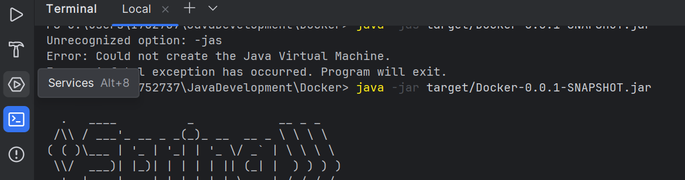
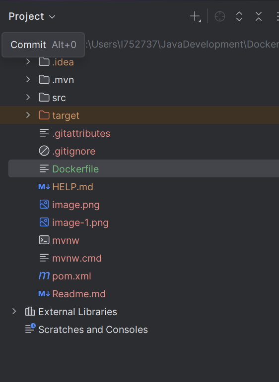

1: Create a project with rest controller so that you can access the url in browser. 
2: In this case we made only 1 end point for hello world.

click on maven goal

3: select MVN Package and it will start execution and will create one jar file under target folder.

in terminal execute command java -jar target/fileName.jar 

Now this project is running using jar file.

Docker Notes: https://github.com/teluskoOrg/Docker-Source-Code

In my case run the file with : docker run -p 8080:8080 docker/rest:v2 java -jar /tmp/Docker-0.0.1-SNAPSHOT.jar

Steps: to create image which contain jar file and using that image we can run jar file in container:
1 Create Dockerfile in project : 

2:Write below code inside that:

FROM openjdk:22-jdk   // This is image name of existing image.
ADD target/Docker-0.0.1-SNAPSHOT.jar rest-demo.jar   // referencing source jar to destination jar file;
ENTRYPOINT ["java","-jar","/rest-demo.jar"]  // This is the command by which code will be working.

3: Now in terminal execute these commands:
a: docker build -t docker/rest:v3 .
b: docker run -p 8080:8080 docker/rest:v3

You will see that your jar file is running in container with the image docker/rest:v3