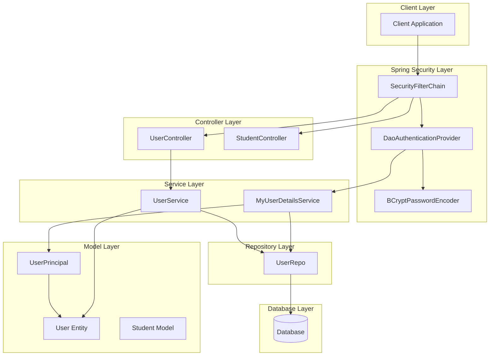
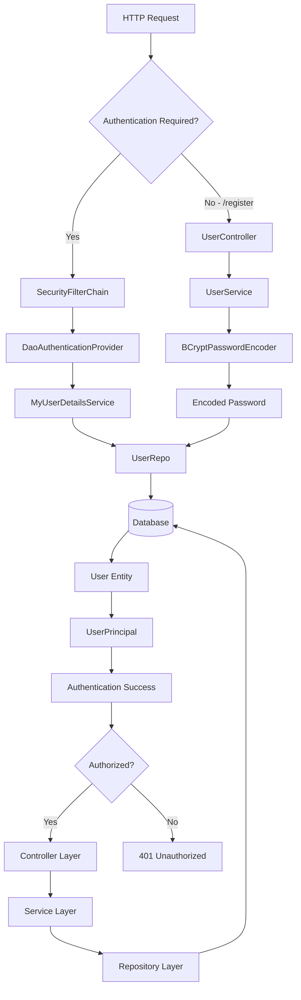

# Spring Security Tutorial - Architecture Overview

## System Architecture Diagram

## Component Interaction Flow

## Security Filter Chain Configuration

The application uses a custom security configuration with the following key features:

### Authentication Flow
1. **HTTP Basic Authentication**: Credentials sent in Authorization header
2. **Stateless Sessions**: No server-side session storage
3. **Database Authentication**: Users stored in database with BCrypt passwords
4. **Custom UserDetailsService**: Loads user data from database

### Authorization Rules
- All endpoints except `/register` require authentication
- Single role "USER" assigned to all authenticated users
- Custom authorization logic in `UserService.findUserById()`

## Key Security Components

### 1. SecurityConfig
- Configures security filter chain
- Disables CSRF for stateless API
- Sets up HTTP Basic authentication
- Configures BCrypt password encoder

### 2. MyUserDetailsService
- Implements Spring Security's UserDetailsService
- Loads user from database by username
- Returns UserPrincipal wrapper

### 3. UserPrincipal
- Implements UserDetails interface
- Wraps User entity for Spring Security
- Provides user authorities and account status

### 4. DaoAuthenticationProvider
- Authenticates users against database
- Uses BCrypt for password verification
- Integrates with custom UserDetailsService

## Data Flow Summary

1. **Registration**: Client → UserController → UserService → BCrypt → UserRepo → Database
2. **Authentication**: Client → SecurityFilterChain → DaoAuthenticationProvider → MyUserDetailsService → UserRepo → Database
3. **Authorization**: SecurityContextHolder → UserPrincipal → User verification
4. **Protected Resources**: Authenticated requests → Controllers → Services → Repositories → Database

This architecture provides a secure, stateless REST API with database-backed authentication and proper password encryption.
