# Spring Security Tutorial - Complete Sequence Diagram

## Project Overview
This Spring Security project implements:
- Database-backed user authentication
- BCrypt password encoding
- Stateless session management
- HTTP Basic Authentication
- User registration and retrieval endpoints
- Student management endpoints

## Main Sequence Diagrams

### 1. User Registration Flow


### 2. Authentication Flow (Login)


### 3. Authorized Request Flow (Get User by ID)

```mermaid
sequenceDiagram
    participant Client
    participant SecurityFilterChain
    participant UserController
    participant UserService
    participant SecurityContextHolder
    participant UserRepo
    participant Database

    Client->>SecurityFilterChain: GET /user/{id} with Basic Auth
    SecurityFilterChain->>SecurityFilterChain: Authenticate user (as above)
    
    alt Authentication successful
        SecurityFilterChain->>UserController: getUsers(id)
        UserController->>UserService: findUserById(id)
        UserService->>SecurityContextHolder: getContext().getAuthentication()
        SecurityContextHolder-->>UserService: Authentication object
        UserService->>UserService: Extract UserPrincipal from Authentication
        UserService->>UserService: Get username from UserPrincipal
        UserService->>UserRepo: findByUsername(username)
        UserRepo->>Database: SELECT user by username
        Database-->>UserRepo: User data
        UserRepo-->>UserService: User object
        
        alt User authorized for this ID
            UserService-->>UserController: User object
            UserController-->>SecurityFilterChain: User response
            SecurityFilterChain-->>Client: 200 OK with User data
        else User not authorized
            UserService-->>UserController: Empty User object
            UserController-->>SecurityFilterChain: Empty User response
            SecurityFilterChain-->>Client: 200 OK with empty User
        end
    else Authentication failed
        SecurityFilterChain-->>Client: 401 Unauthorized
    end
```



### 4. Student Endpoints Flow (Protected Resources)


### 5. CSRF Token Flow (When Enabled)


## Security Configuration Details

### Key Components:
1. **SecurityFilterChain**: Configured for stateless sessions, HTTP Basic auth, CSRF disabled
2. **DaoAuthenticationProvider**: Uses custom UserDetailsService and BCrypt encoder
3. **MyUserDetailsService**: Loads users from database via UserRepo
4. **UserPrincipal**: Wraps User entity to implement UserDetails interface

### Security Features:
- **Stateless Sessions**: `SessionCreationPolicy.STATELESS`
- **Password Encoding**: BCrypt with strength 12
- **Authentication**: HTTP Basic Authentication
- **Authorization**: All requests require authentication
- **CSRF**: Disabled for stateless API

## Database Schema

```sql
-- Users table structure (inferred from User entity)
CREATE TABLE users (
    id INT,
    username VARCHAR(255) PRIMARY KEY,
    password VARCHAR(255)
);
```

## API Endpoints Summary

| Endpoint | Method | Authentication Required | Description |
|----------|--------|------------------------|-------------|
| `/register` | POST | No | Register new user |
| `/user/{id}` | GET | Yes | Get user by ID (with authorization check) |
| `/students` | GET | Yes | Get all students |
| `/students` | POST | Yes | Add new student |
| `/csrfToken` | GET | Yes | Get CSRF token (when enabled) |

## Notes

1. **Password Security**: All passwords are BCrypt encoded before storage
2. **Session Management**: Stateless - no server-side sessions maintained
3. **Authorization**: Basic role-based with "USER" role for all authenticated users
4. **Database Integration**: JPA/Hibernate with custom repository methods
5. **Error Handling**: Proper exception handling for authentication failures
