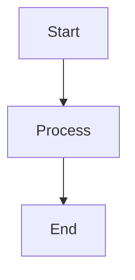

# How to View Mermaid Diagrams in VS Code

## 🔧 **Steps to View Mermaid Diagrams:**

### **Method 1: Using Markdown Preview (Recommended)**

1. **Open the file**: `ShoppingApp_FlowChart_and_SequenceDiagrams.md`
2. **Open Preview**: 
   - Press `Ctrl+Shift+V` (Windows/Linux) or `Cmd+Shift+V` (Mac)
   - OR right-click on the file and select "Open Preview"
   - OR use Command Palette (`Ctrl+Shift+P`) and type "Markdown: Open Preview"

3. **View Side by Side**:
   - Press `Ctrl+K V` (Windows/Linux) or `Cmd+K V` (Mac)
   - This opens preview alongside the source code

### **Method 2: Using Mermaid Preview Extension**

If you have a dedicated Mermaid extension:

1. **Open Command Palette**: `Ctrl+Shift+P` (Windows/Linux) or `Cmd+Shift+P` (Mac)
2. **Type**: "Mermaid: Preview"
3. **Select**: The mermaid preview command

### **Method 3: Using Mermaid Editor Extension**

1. **Right-click** on any mermaid code block
2. **Select**: "Open in Mermaid Editor" (if available)

## 🎯 **What You Should See:**

When viewing the preview, you'll see:
- **Flow Charts** as visual diagrams with boxes and arrows
- **Sequence Diagrams** as timeline-based interactions
- **Interactive Elements** (you can sometimes click and zoom)

## 🔍 **Troubleshooting:**

### **If diagrams don't render:**

1. **Check Extension**: Make sure you have one of these extensions installed:
   - "Markdown Preview Mermaid Support"
   - "Mermaid Markdown Syntax Highlighting"
   - "Mermaid Preview"

2. **Reload VS Code**: Sometimes extensions need a restart
   - Press `Ctrl+Shift+P` → "Developer: Reload Window"

3. **Check Syntax**: Ensure mermaid code blocks start with:
   ```
   ```mermaid
   ```

### **Popular Mermaid Extensions for VS Code:**

- **Markdown Preview Mermaid Support** by Matt Bierner
- **Mermaid Preview** by Yash Singh
- **Mermaid Markdown Syntax Highlighting** by Bpev

## 📱 **Alternative Online Viewing:**

If VS Code preview doesn't work, you can:

1. **Copy the mermaid code** (without the ```mermaid tags)
2. **Go to**: https://mermaid.live/
3. **Paste the code** and view the rendered diagram

## 🚀 **Quick Test:**

Try this simple mermaid diagram to test if it's working:



If you see boxes and arrows instead of just text, your setup is working!