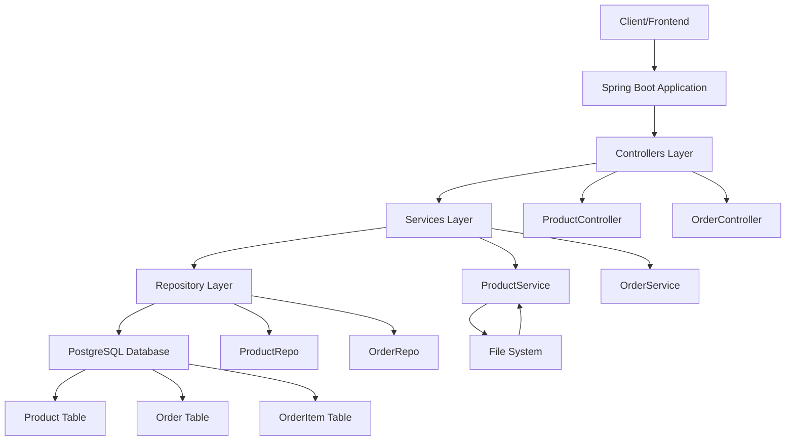
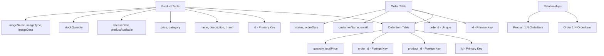
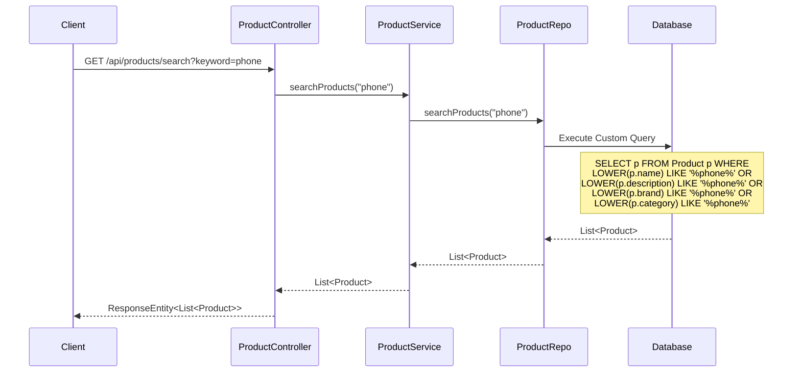
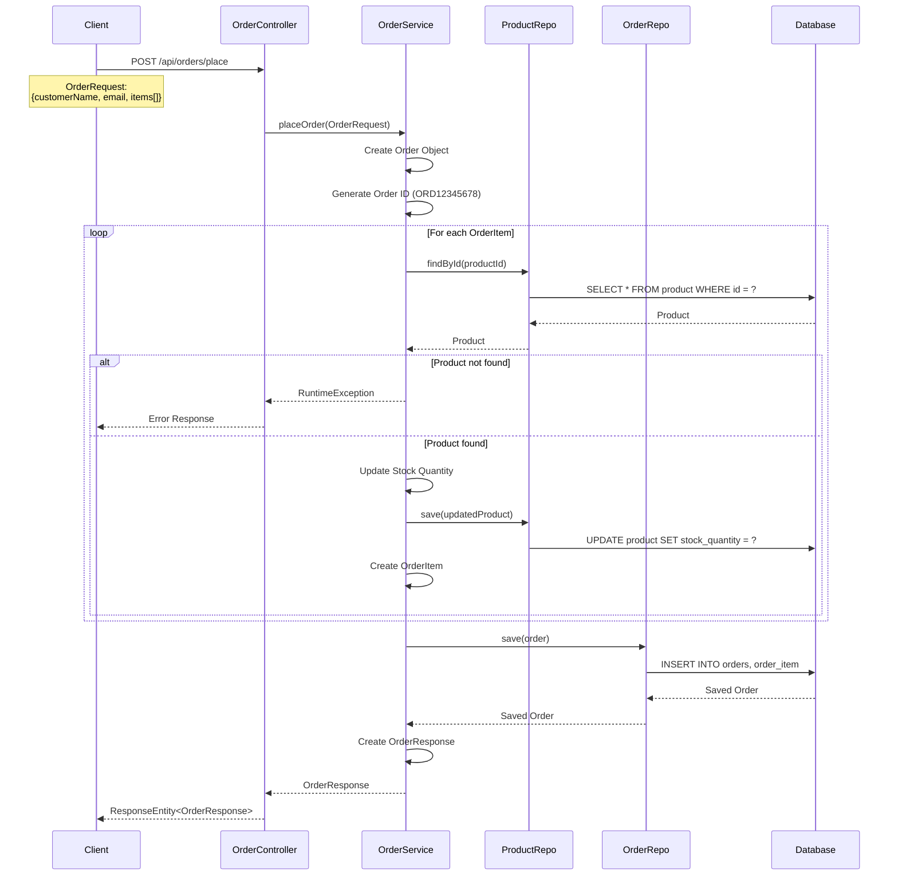
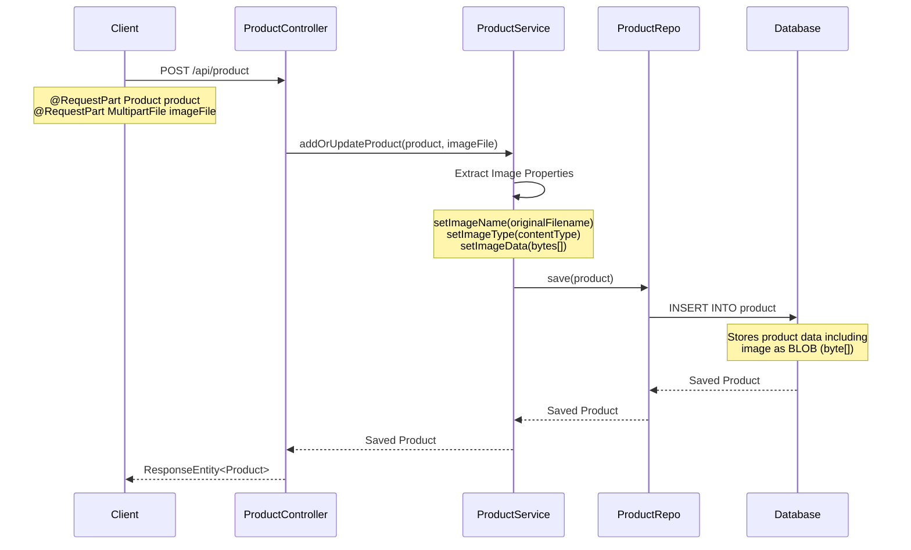
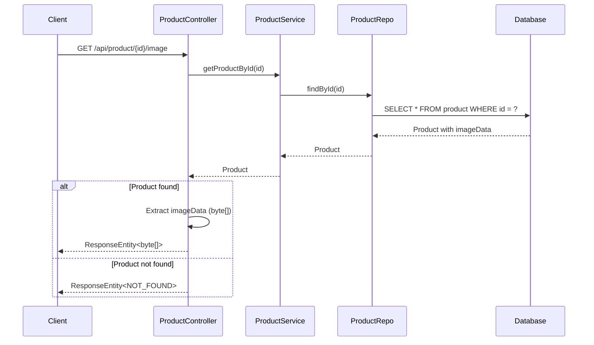
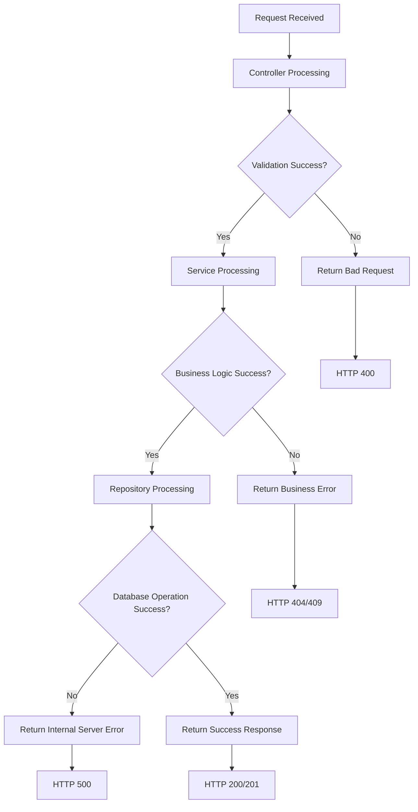

# ShoppingApp - Flow Charts and Sequence Diagrams

## 🔄 **1. Overall System Architecture Flow Chart**



## 📦 **2. Product Management Flow Chart**

```mermaid
graph TD
    A[Start] --> B{Request Type?}
    
    B -->|GET /products| C[Get All Products]
    B -->|GET /product/{id}| D[Get Product by ID]
    B -->|POST /product| E[Add New Product]
    B -->|PUT /product| F[Update Product]
    B -->|DELETE /product/{id}| G[Delete Product]
    B -->|GET /products/search| H[Search Products]
    B -->|GET /product/{id}/image| I[Get Product Image]
    
    C --> C1[ProductService.getAllProducts()]
    C1 --> C2[ProductRepo.findAll()]
    C2 --> C3[Return List<Product>]
    
    D --> D1[ProductService.getProductById()]
    D1 --> D2[ProductRepo.findById()]
    D2 --> D3{Product Found?}
    D3 -->|Yes| D4[Return Product]
    D3 -->|No| D5[Return Product(-1)]
    
    E --> E1[Validate Product Data]
    E1 --> E2[Process Image Upload]
    E2 --> E3[Set Image Properties]
    E3 --> E4[ProductRepo.save()]
    E4 --> E5[Return Saved Product]
    
    F --> F1[Get Existing Product]
    F1 --> F2[Update Product Data]
    F2 --> F3[Process New Image]
    F3 --> F4[ProductRepo.save()]
    F4 --> F5[Return Updated Product]
    
    G --> G1[Check Product Exists]
    G1 --> G2{Product Found?}
    G2 -->|Yes| G3[ProductRepo.deleteById()]
    G2 -->|No| G4[Return Not Found]
    G3 --> G5[Return Success]
    
    H --> H1[ProductService.searchProducts()]
    H1 --> H2[ProductRepo.searchProducts()]
    H2 --> H3[Execute Custom Query]
    H3 --> H4[Return Matching Products]
    
    I --> I1[Get Product by ID]
    I1 --> I2{Product Found?}
    I2 -->|Yes| I3[Return Image Data]
    I2 -->|No| I4[Return Not Found]
    
    C3 --> J[End]
    D4 --> J
    D5 --> J
    E5 --> J
    F5 --> J
    G4 --> J
    G5 --> J
    H4 --> J
    I3 --> J
    I4 --> J
```

## 🛒 **3. Order Management Flow Chart**

```mermaid
graph TD
    A[Start] --> B{Request Type?}
    
    B -->|POST /orders/place| C[Place Order]
    B -->|GET /orders| D[Get All Orders]
    
    C --> C1[Validate Order Request]
    C1 --> C2[Create New Order Object]
    C2 --> C3[Generate Unique Order ID]
    C3 --> C4[Set Order Details]
    C4 --> C5[Process Order Items]
    
    C5 --> C6[For Each Order Item]
    C6 --> C7[Find Product by ID]
    C7 --> C8{Product Exists?}
    C8 -->|No| C9[Throw Exception]
    C8 -->|Yes| C10[Check Stock Availability]
    C10 --> C11{Stock Available?}
    C11 -->|No| C12[Throw Exception]
    C11 -->|Yes| C13[Update Stock Quantity]
    C13 --> C14[Calculate Total Price]
    C14 --> C15[Create OrderItem]
    C15 --> C16{More Items?}
    C16 -->|Yes| C6
    C16 -->|No| C17[Save Order]
    
    C17 --> C18[OrderRepo.save()]
    C18 --> C19[Create Order Response]
    C19 --> C20[Return Order Response]
    
    D --> D1[OrderService.getAllOrderResponses()]
    D1 --> D2[OrderRepo.findAll()]
    D2 --> D3[For Each Order]
    D3 --> D4[Create OrderItemResponse List]
    D4 --> D5[Create OrderResponse]
    D5 --> D6{More Orders?}
    D6 -->|Yes| D3
    D6 -->|No| D7[Return Order Response List]
    
    C9 --> E[End with Error]
    C12 --> E
    C20 --> F[End with Success]
    D7 --> F
```

## 📊 **4. Database Relationship Flow Chart**



## 🔄 **5. Product Search Sequence Diagram**



## 🛍️ **6. Order Placement Sequence Diagram**



## 📱 **7. Product Image Upload Sequence Diagram**



## 🔍 **8. Get Product Image Sequence Diagram**



## 🏗️ **9. Application Startup Flow Chart**

```mermaid
graph TD
    A[Application Start] --> B[ShoppingAppApplication.main()]
    B --> C[SpringApplication.run()]
    C --> D[Load Configuration]
    D --> E[application.properties]
    E --> F[Database Connection Setup]
    F --> G[PostgreSQL Connection]
    G --> H[JPA/Hibernate Initialization]
    H --> I[Entity Scanning]
    I --> J[Repository Bean Creation]
    J --> K[Service Bean Creation]
    K --> L[Controller Bean Creation]
    L --> M[Embedded Tomcat Server Start]
    M --> N[Application Ready]
    N --> O[Listening on Port 8080]
```

## 📋 **10. Error Handling Flow Chart**



## 🔐 **Key Points:**

1. **Layered Architecture**: Clear separation between Controller, Service, and Repository layers
2. **Database Relationships**: Proper foreign key relationships between entities
3. **Transaction Management**: @Transactional ensures data consistency
4. **Error Handling**: Proper HTTP status codes and exception handling
5. **Image Processing**: Binary data storage and retrieval
6. **Stock Management**: Automatic inventory updates during order processing
7. **Unique ID Generation**: UUID-based order ID creation
8. **Search Functionality**: Multi-field search with custom queries

These diagrams show the complete flow of data and operations in the ShoppingApp system, from client requests to database operations and back to the client response.