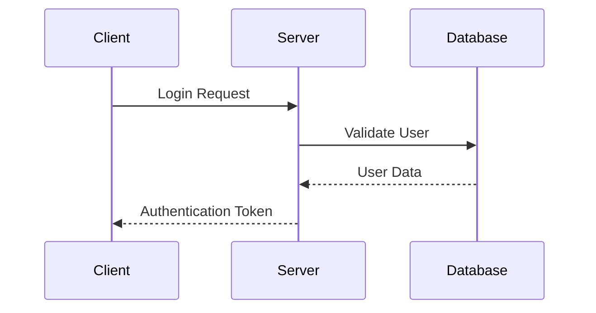

# How to View Mermaid Diagrams

## Method 1: VS Code with Mermaid Extension (Recommended)

1. **Install Mermaid Preview Extension**:
   - Open VS Code Extensions (Ctrl+Shift+X)
   - Search for "Mermaid Preview" by vstirbu
   - Install the extension

2. **View the Diagrams**:
   - Open any of the markdown files with Mermaid code
   - Right-click in the editor
   - Select "Open Preview to the Side" or press `Ctrl+K V`
   - The diagrams will render automatically

## Method 2: Online Mermaid Live Editor

1. **Visit Mermaid Live Editor**:
   - Go to: https://mermaid.live/
   
2. **Copy and Paste**:
   - Copy any Mermaid code block from the documentation
   - Paste it into the online editor
   - The diagram will render instantly
   - You can export as PNG, SVG, or PDF

## Method 3: GitHub/GitLab (if using version control)

1. **Push to Repository**:
   - Commit and push the markdown files to GitHub or GitLab
   - View the files in the web interface
   - Mermaid diagrams render automatically

## Method 4: Mermaid CLI (Command Line)

1. **Install Mermaid CLI**:
   ```bash
   npm install -g @mermaid-js/mermaid-cli
   ```

2. **Generate Images**:
   ```bash
   mmdc -i input.mmd -o output.png
   ```

## Method 5: Other Markdown Viewers

- **Typora**: Premium markdown editor with built-in Mermaid support
- **Mark Text**: Free markdown editor with Mermaid support
- **Obsidian**: Note-taking app with Mermaid plugin

## Quick Test - Copy This Code to Mermaid Live Editor



## Example: Using VS Code Extension

1. Install "Mermaid Preview" extension
2. Open `Spring_Security_Sequence_Diagram.md`
3. Press `Ctrl+Shift+P` and type "Mermaid: Preview"
4. Select the preview option
5. All diagrams will render in a preview pane

## Troubleshooting

- If diagrams don't render, check that the Mermaid code blocks start with ```mermaid
- Ensure proper indentation in the Mermaid syntax
- Try refreshing the preview if diagrams don't update

The easiest method is using the VS Code Mermaid Preview extension or the online Mermaid Live Editor at https://mermaid.live/
